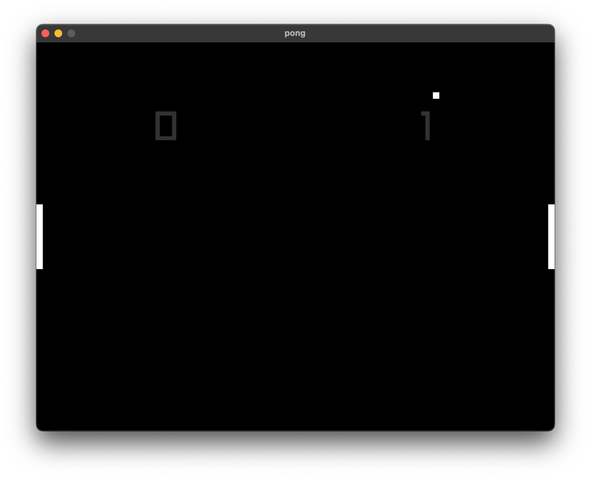

# Mue

Simple "framework" project which runs a javascript-based game project using
[mujs](https://mujs.com/) under the hood. What this software does is interact with your
js project by exposing and calling functions from within a c environment which suits you with
a gameloop in order to let you write easily a game straight away with no caring on the used c libraries.

Inspired by [tsoding's lust2d video](https://www.youtube.com/watch?v=4kuxeEnFVYw&t=595s&ab_channel=TsodingDaily)
I did practically the same but using modern typescript for examples and also implementing quite some
functions for like graphics, text, input handling, and pretty much that's it.

The source code is almost entirely in a single [main.c](../src/main.c) file, but there's also
some examples in the [examples](../examples) folder which also shows usage of typescript.



## Getting started

> [!NOTE]
> This project really is no production ready and is also not intended to be whatsoever (at least for now i do think so)
> but feel free to fork and add more features if you want to, i just wanted to have some fun and pretty much did.

```sh
git clone https://github.com/AlphaTechnolog/mue.git
cd mue
```

Then make sure you have the next dependencies installed in your system.

- make
- gcc / clang
- bun (if you wanna build examples)

```sh
make
```

> [!TODO]
> Add support for linux build since im building right now on a mac, but you should be able to suit
> the [lib](../lib) folder with the appropiate `.so` files, and maybe modify a little bit the [Makefile](../Makefile)
> for cflags/ldflags.

Then the `mue` binary should appear right away, if you wanna run an example, just build it with
bun and run it like this.

```sh
cd examples/<x>
bun x tsc && cd -
./mue ./examples/<x>
```

## Examples

The included examples are:

- [rectangle](../examples/rectangle): Really that's it, a little rectangle, but serves as a very basic example
- [pong](../examples/pong): A simple pong implementation which uses text, movement, collisions, etc.

> [!NOTE]
> I'll be adding more examples as the time goes, specially basic ones which serves as introduction since
> pong is a little large considering we're coming from the rectangle one. PR's are also welcome.
